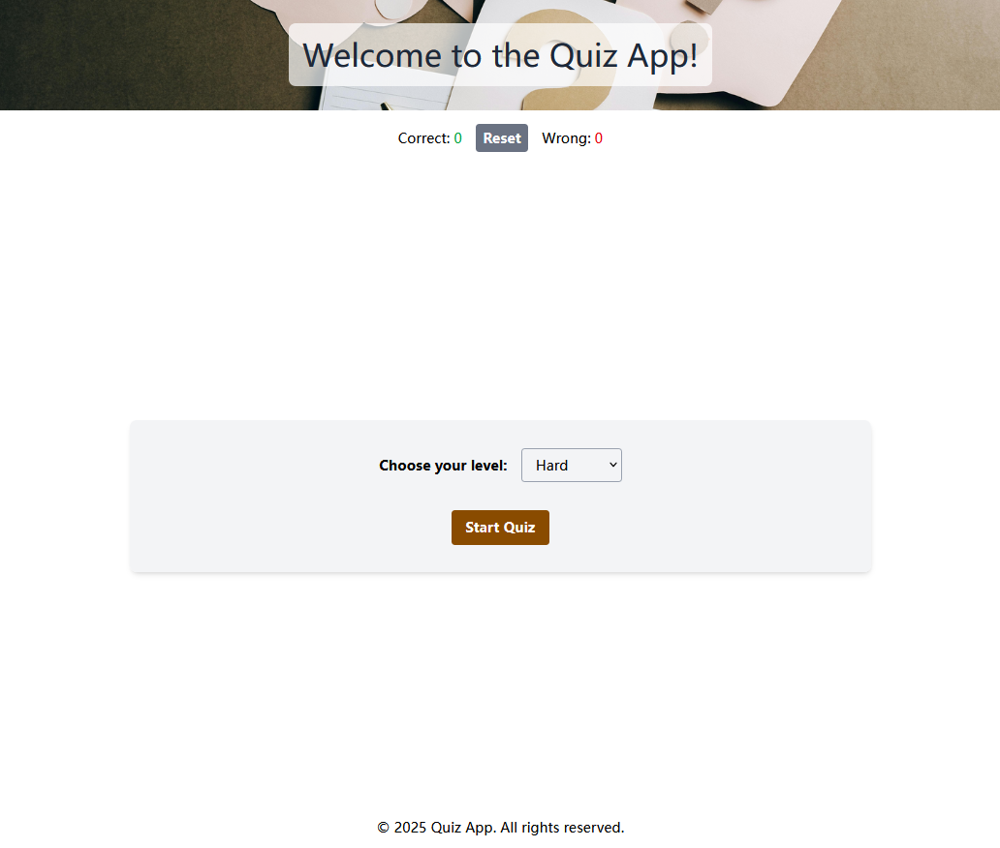
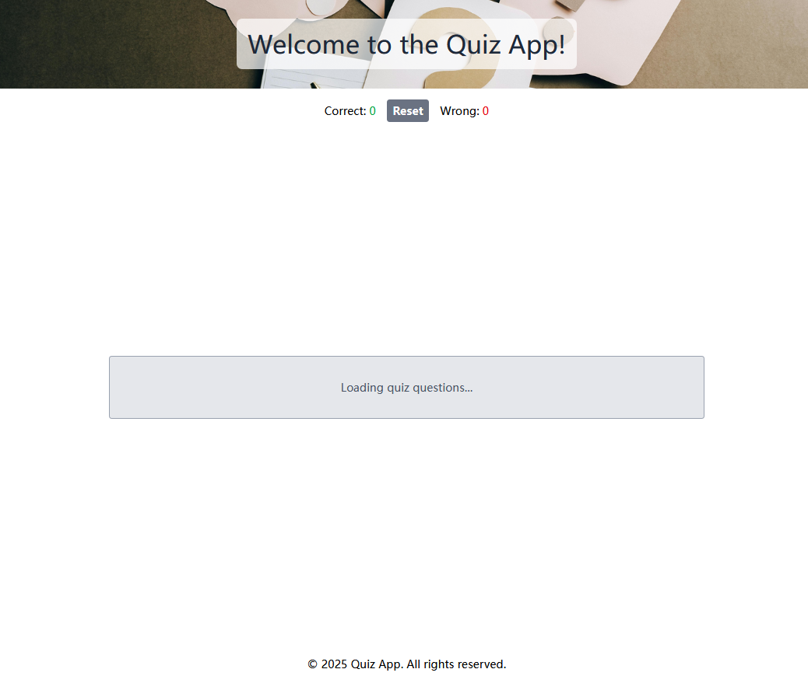
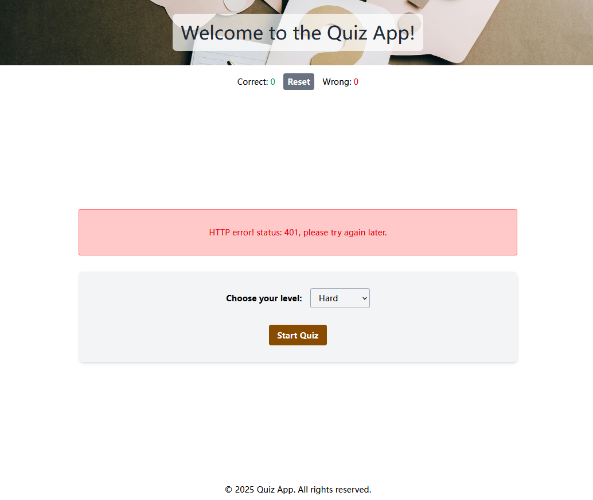
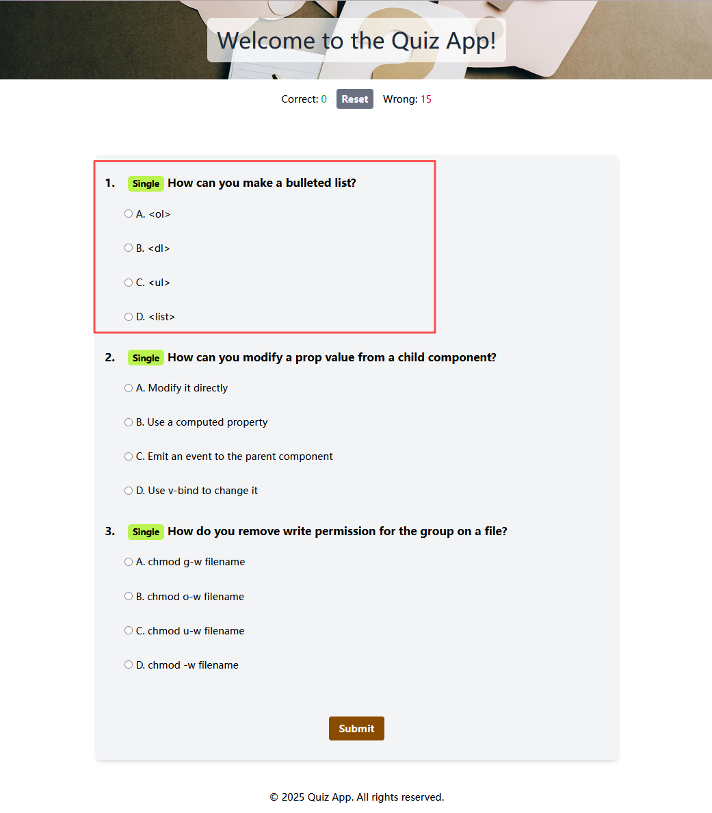
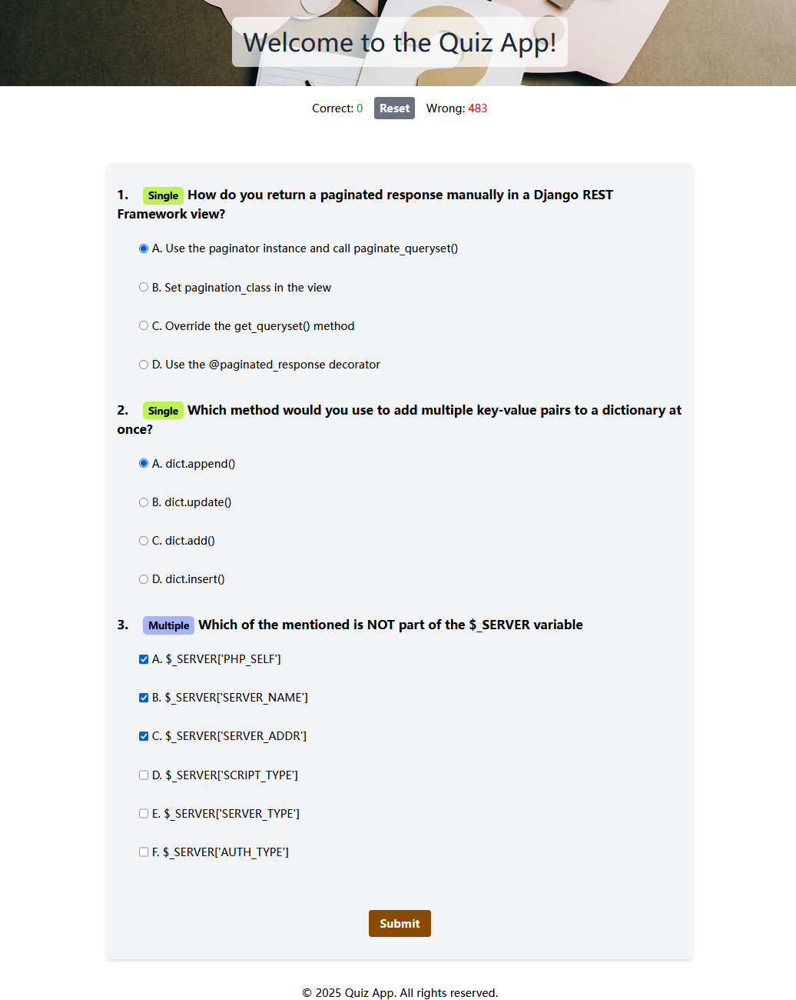
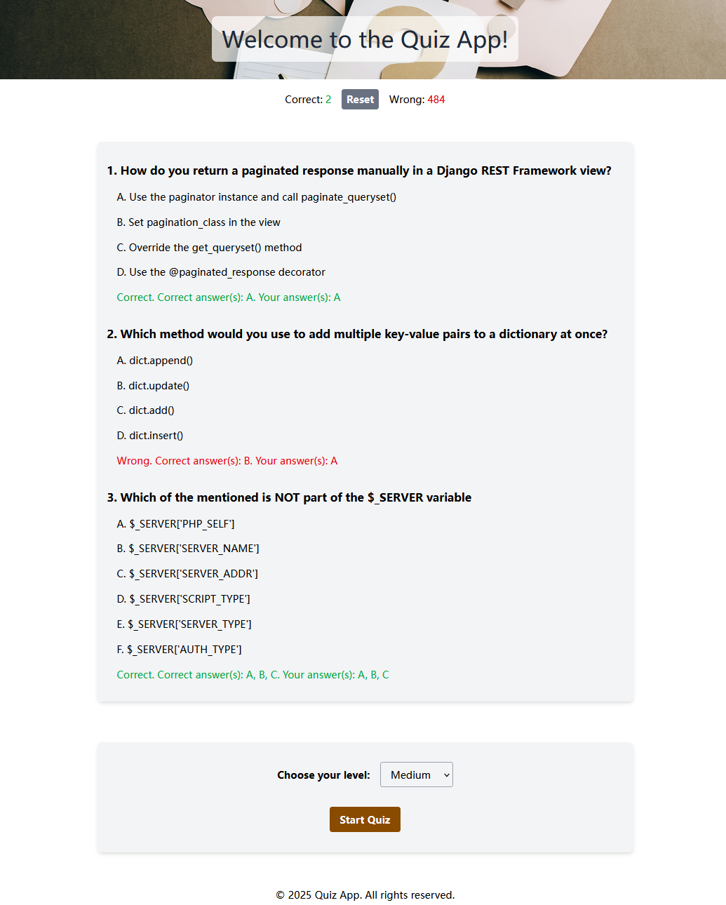
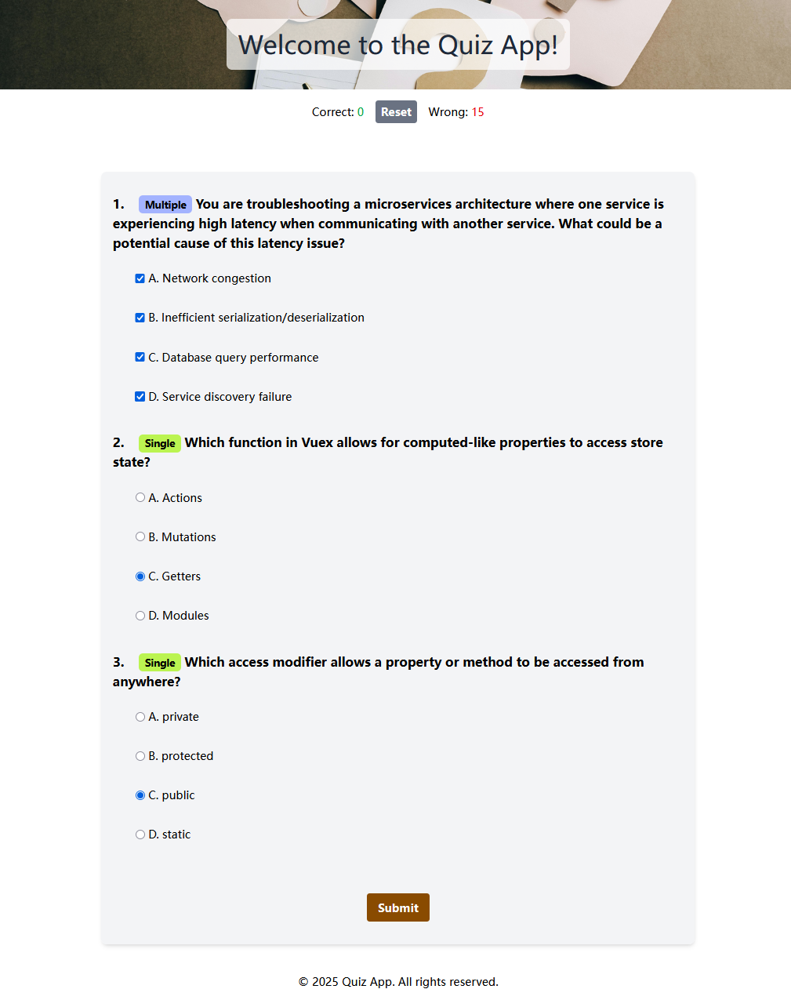
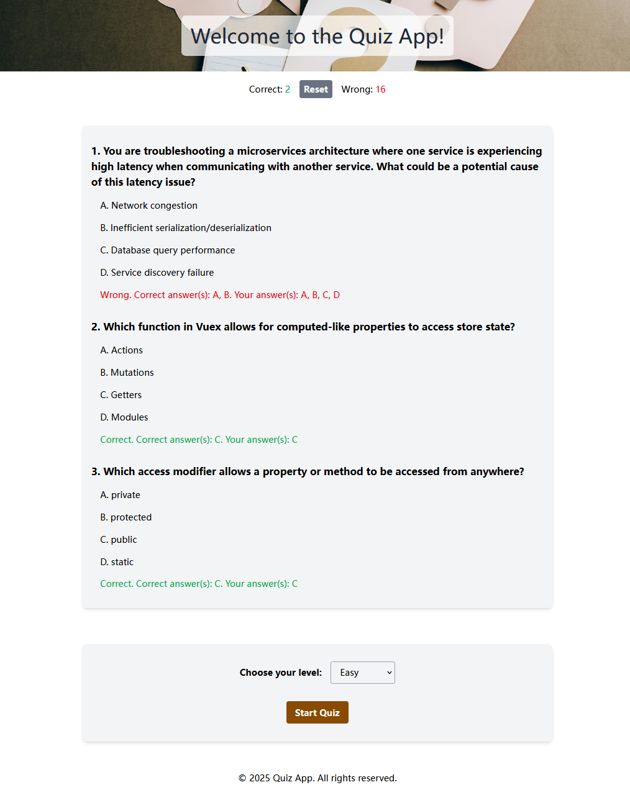

# note

## tailwindcss setup

[Setup Notes](./docs/tailwindcss-setup.md)

## Challenges and Solutions

### 1. Loading Message Notification

Challenge: The Quiz API sometimes takes a long time to load, making the page feel like it's freezing for users.

Solution: A message div was designed specifically to display loading indicators and error messages to improve the user experience.

### 2. HTML Parsing Issues

Challenge: Questions retrieved from the Quiz API may contain HTML code, which might be incorrectly parsed during display.

Solution: When displaying the question stem and options, first generate a text node using "document.createTextNode", then append it to the parent node. Instead of directly using "innerHTML".

### 3. Multiple Choice Questions

Challenge: Multiple choice questions occasionally appear and require special handling.

Solution: First, the display of multiple choice questions needs to be addressed; the input type needs to be differentiated between radio and checkbox. Second, how to correctly handle the multiple choice answers in formData? I used the getAll method to retrieve the answers from formData. Finally, how to compare the multiple choice answers with the correct answers? This involves comparing two arrays. I sorted the arrays, converted them to strings, and compared the strings to determine if the answer was correct.

